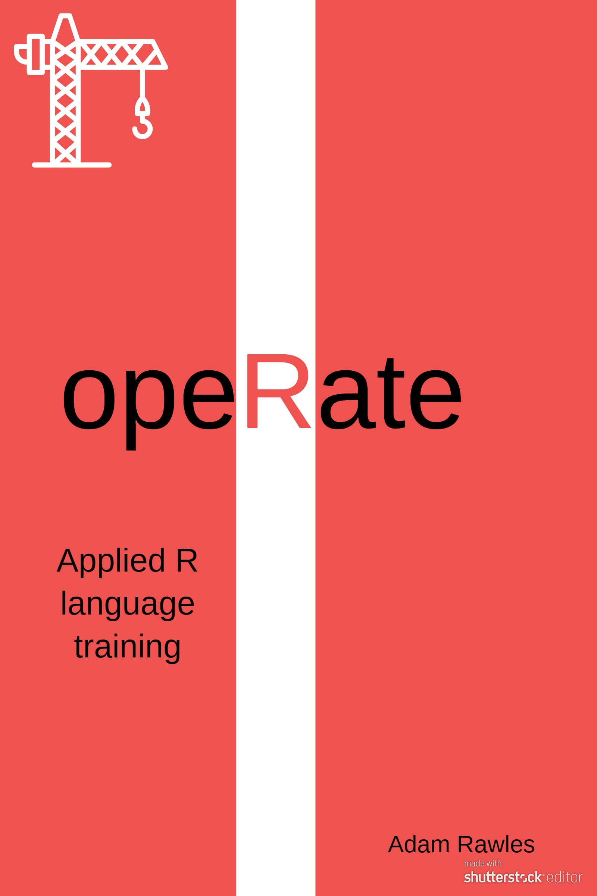

# opeRate 

This package holds the training materials for the opeRate book.

The opeRate book is aimed at those with an understanding of the fundamentals of R, who want to apply their knowledge to data analysis and programming.

For those at a more beginner level, I am also working on a separate book called teacheR that looks more at the fundamentals of R.

This book is a work in progress, so any feedback is greatly appreciated. If you do see anything off, please raise a [GitHub issue](https://github.com/arawles/operate/issues).

The book is currently hosted [here](operate.arawles.co.uk). There is also a PDF and EBook version available through that link.
