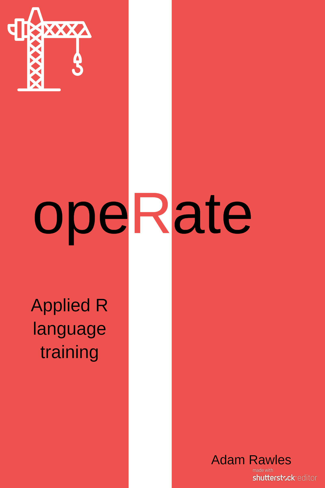

# opeRate



## Overview

This book is a collection of materials to help users apply their fundamental R knowledge to real programming and analysis. This book is the second in a series of R books I've been working on. The first in the series ([teacheR](https://teacher.arawles.co.uk)) focuses on the fundamentals of the R language. I would recommend reading teacheR first if you're brand new to the language. It's split into two parts ("For Students" and "For Teachers"). To get the most out of this book, I would suggest that you are at least comfortable with the entirety of the "For Students" section, but it wouldn't hurt to go through the "For Teachers" section while you're at it.

As with the [teacheR](teacher.arawles.co.uk) book, this is a work in progress, so please feel free to make any suggestions or corrections via this book's [GitHub repository](www.github.com/arawles/operate/issues).

```{r, results = "asis", echo = FALSE, message = FALSE}
library(dplyr)
contributors <- read.csv("contribs.csv", stringsAsFactors = FALSE)
contributors <- contributors %>% 
  mutate(
    link = glue::glue("[\\@{login}](https://github.com/{login})"),
    desc = ifelse(is.na(name), link, glue::glue("{name} ({link})"))
  )

if (nrow(contributors)) {
  cat("### Acknowledgements\n\n",
      "This book was made possible with the help of those who raised issues and proposed pull requests. With thanks to:\n\n",
      paste0(contributors$desc, collapse = ", ")
  )
}
```

## About Me

I began using R in my second year of university, whilst studying psychology. Like so many others before me, I started using R for a particular project - in my case, it was for an analysis of publication bias - before deciding that I wanted to expand my skillset and learn to apply R to lots of different situations. Because I took this approach however, I didn't really develop a fundamental knowledge of how R worked before I started - I just kind of jumped in at the deep end. As a quick analogy, it was a bit like starting with this book without reading the teacheR book first - I kind of knew what was going on, but I was filling in a lot of gaps along the way.

And so that is why I decided to develop this series of books - to hopefully help anyone who may find themselves in a similar position that I was in those years ago. If you want to use R but feel as though you don't know where to start, then hopefully this book will give you a good overview of some of the different ways that R can be used or applied.

## Using R

In my primary years, analysis in R took me longer than it would take to do the same analysis in something like Excel. And that's okay. R is a complicated and flexible system, and so your first analysis piece will never be particularly efficient. As you stick with it however, and you get used to the methods of automation and a pipeline of execution, you'll find yourself working much more efficiently, performing analyses in half the time. And that's what I hope I can impart with this book; it'll be slow at first, but you'll notice a turning point when you complete your first analysis project in a decent timescale and you'll never look back. Then, before long, you'll have a repertoire of analysis tools at your disposal that make you a crucial member of any data analysis team.

And so in this book we're going to look at some of the common tasks that one might decide to do in R. Keep in mind though that we can't cover everything, so just because it's not in the book doesn't mean that it can't be done!


