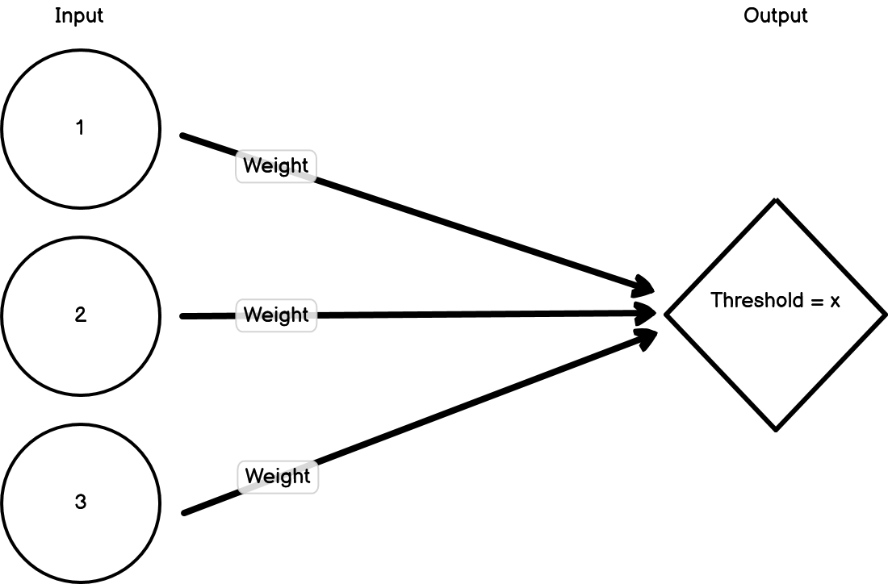
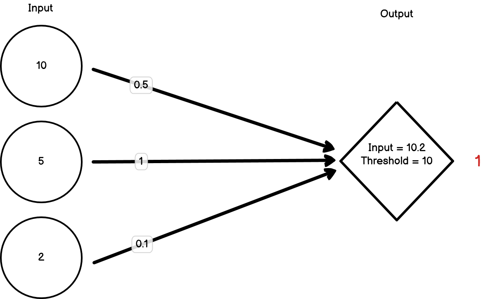
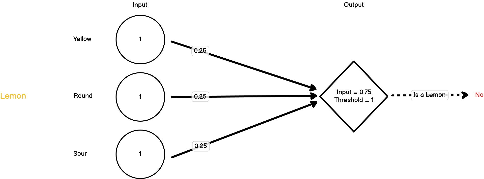

# Machine Learning

Machine learning (ML) and artificial intelligence (AI) are two buzzwords that are used constantly, sometimes appropriately and sometimes not. At its core however, ML is still just a subset of statistical modelling. Although computing power has increased exponentially over the last 20 years, allowing us to deal with more data and perform more calculations per second, many of the methods that underpin modern machine learning methods are not new, and in many cases aren't particularly complicated. So now we're going to try and understand some of the basics of a particular type of machine learning model - a neural network - and how we can create one with R.

## Neural networks

### Introduction

Neural networks were developed in an attempt to model how neurons in the brain may function. Neurons process inputs and then produce outputs by either firing or not firing. If the inputs to a neuron breach a threshold, then the neuron fires. If that threshold isn't reached, then it doesn't fire. That neuron will then become an input to a subsequent neuron. This network of interconnected nodes can then connect a certain input pattern with a corresponding output pattern.

Importantly, the inputs have weights that can change due to feedback. So if an input erroneously results in a neuron firing, then the weights of the inputs can be adjusted to ensure that the neuron doesn't fire again if it's presented with the same information.

```{r, label = "nn-prototype", echo = FALSE}

```

```{r, label = "nn-positive", out.width='50%', echo = FALSE}

```

```{r, label = "nn-negative", out.width='50%', echo = FALSE}
knitr::include_graphics("./img/Negative.png")
```

### Example

Let's model how a neural network might learn to identify a lemon from a collection of fruits. When an object is presented, it's broken down into its constituent features, which are then treated as the first set of inputs. For now, let's imagine we have three features; 'is yellow', 'is round', 'is sour'. The value of each of these is either going to be 1 (true) or 0 (false). These three inputs then feed into a second node. That node has a threshold that needs to be met before it will fire. When it fires, that means the model thinks that the fruit that's been presented is a lemon.

```{r, echo = FALSE}

```

To start off, let's set the weights for our inputs to all be 1, and the threshold for our second node to fire as 1. Let's present our first object, which is an orange:

```{r, echo = FALSE}
knitr::include_graphics("./img/Orange.png")
```

The neuron has fired, but it's definitely not a lemon. The orange has triggered one of the three inputs to be 1, but because the threshold for the second node to fire is 1, that one input is enough to pass the threshold. We need to decrease our weights. For now, let's drop them all down to 0.25.

Now let's present our next object, which is a lime:

```{r, echo = FALSE}
knitr::include_graphics("./img/Lime.png")
```

In this case, we've triggered two of the three inputs but this time the threshold hasn't been met and so the second node hasn't fired. The model is saying that this isn't a lemon and it's correct. For now, we don't need to change the weights.

Next, we present it with a lemon:

```{r, echo = FALSE}

```

Now all of the three inputs are triggered, but this isn't enough to pass the threshold, so the second node doesn't fire. This is a lemon though, so it should have fired. We need to change our weights again.

We won't go through the painstaking process of changing the weights until we get them right, but hopefully this has demonstrated the key process by which a neural network learns; by changing the weights of its input layers to match inputs with outputs.

In this case, we've done an extremely simple example. In reality, no neural network is as simple as this because it would be pointless. Instead, neural networks usually have multiple layers and many many more inputs. If we consider models that can read through text documents and classify them (e.g. classify reviews as being positive or negative), these will often use every word in the text as an input. As you can imagine, this can lead to a lot of inputs!

### Neural Networks in R

There are lots of different packages that have been developed to create neural networks in R. For larger projects, I use the `{keras}` package which used the TensorFlow library to create machine learning models with support for GPU-accelerated learning. `{keras}` requires Python to be installed however and can be tough to learn due to its scale and flexiblity. For now, we're going to use the `{neuralnet}` package. It's a little on the older side but it uses a similar syntax to the `lm()` function so we can use what we've learnt so far.

For this example, let's create a neural network that will predict whether the publisher was Take-Two or Sega based on what platform the game was released on, what the genre was and how well the game sold. Let's start with our dataset:

```{r}

nn_vgsales <- tidy_vg_sales %>%
  dplyr::filter(Sales > 1) %>%
  dplyr::filter(Country == "Global") %>%
  dplyr::filter(Publisher %in% c("LucasArts", "Sega")) %>%
  # Need to convert these columns to numeric for the NN
  dplyr::mutate(dplyr::across(c(Genre, Platform), ~as.numeric(as.factor(.x))))


```

Now let's split the dataset into a training and test set. We're going to use the `{withr}` package to set a random seed when selecting the test and training set so that it's the same each time.

```{r}
# The `with_seed()` just ensures we're using the same training set each time
withr::with_seed(1234, {
  training_indices <- sample(nrow(nn_vgsales), 1/2 * nrow(nn_vgsales))
  
  nn_vgsales_train <- nn_vgsales[training_indices,]
  nn_vgsales_test <- nn_vgsales[-training_indices,]
})

```

Now let's create our model and then plot it using the `{neuralnet}` package.
```{r}
nn <- neuralnet::neuralnet(data = nn_vgsales_train,
                           formula = (Publisher == "LucasArts") + (Publisher == "Sega") ~ Platform + Genre + Sales,
                           # We're creating a classication model rather than a regression model
                           linear.output = FALSE)

plot(nn)
```


Now let's apply our model to our test set and have a look at how good the predictions are:

```{r}
pred <- predict(nn, nn_vgsales_test)
table(nn_vgsales_test$Publisher, apply(pred, 1, which.max))
```

This matrix can help us understand how well the model is predicting. Three useful metrics we can easily calculate from this metric are the model's **accuracy**, **precision** and **recall**.

**Accuracy**
The accuracy is predicted at the model level, and is calculated as the number of correct guesses divided by the total number of cases. In our case that's
`(14+34)/(1+4+14+34)`, which is `r round((14+34)/(1+4+14+34), 2)`.

**Precision**
The precision of a model tells us how many of the instances that were predicted to be in a certain group **were actually** in that group.
Precision, therefore, is a per-group metric. So in our example, we will have a precision metric for both LucasArts and Sega.

The precision is calculated as the number of true positives over the number of true positives plus false positives. For Sega, that's
`34/(34+4)`, which is `r round(34/38, 2)`. For LucasArts, that's `14/(14+1)`, which is `r round(14/15, 2)`. This tells us that our model is more accurate in predicting LucasArts games.

**Recall**
The recall of a model tells us how many instances of a particular group were correctly predicted to be in that group. This answers a different but related question to the one that the precision metric answers. Once again, the recall metric is calculated for each group/classifier.

To calculate our recall metric, we need to divide the number of correctly predicted classifications over the total number of actual instances in that group. For Sega, that's `34/(34+1)`, which is `r round(34/(34+1), 2)`. For LucasArts, that's `14/(14+4)`, which is `r round(14/(14+4), 2)`.


So what should you aim for - high precision or high recall? Well really it depends on what problem you're trying to solve. If you imagine that you've got a model to detect cancer, then you won't want to miss when someone actually does have cancer, even if you'll end up predicting that a few people do have cancer when they don't. To do this, you'll want to prioritise **recall**. Alternatively, say you're building a model to choose which funds to invest in. In that case, the cost of investing is high, so you want to make sure that when you go with a fund, it's actually going to make money, even if you miss out on other funds that would have also made money. In this situation, the **precision** of your model would be more important.